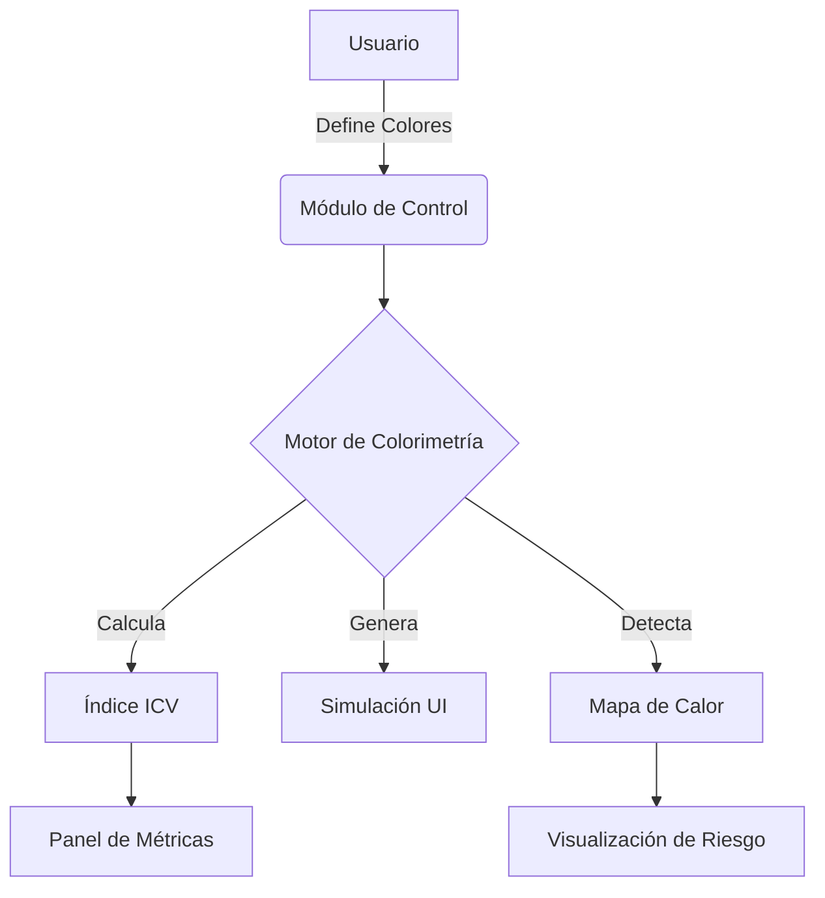

# Evaluación Cuantitativa de la Carga Visual en Interfaces Digitales: Una Propuesta Metodológica basada en Colorimetría Computacional

## 1. Introducción

La ergonomía visual en el entorno digital ha cobrado una relevancia crítica en la última década. Con el aumento exponencial del tiempo frente a pantallas, los factores de riesgo asociados a la Fatiga Visual Digital (DES, Digital Eye Strain) se han convertido en un problema de salud ocupacional de primer orden. 

Este capítulo presenta el desarrollo e implementación de un **Dashboard de Evaluación de Carga Visual (ICV)**, una herramienta tecnológica diseñada para cuantificar, simular y mitigar el impacto ergonómico de las decisiones cromáticas en el diseño de interfaces de usuario (UI).

La propuesta se aleja de la evaluación puramente estética para centrarse en métricas objetivas derivadas de la psicofísica del color y la fisiología de la visión, proponiendo un nuevo índice sintético: el **Índice de Carga Visual (ICV)**.

## 2. Fundamentos Metodológicos

### 2.1 Variables Críticas
Para la construcción del modelo, se aislaron cuatro variables independientes con impacto directo en el sistema acomodativo y sensorial humano:

1.  **Saturación (S)**: La intensidad cromática. Colores altamente saturados requieren mayor procesamiento cortical y atención sostenida.
2.  **Contraste (C)**: La relación de luminancia entre figura y fondo. Niveles extremos (muy bajo o muy alto/glare) aumentan el esfuerzo acomodativo.
3.  **Brillo/Luminancia (B)**: La cantidad de luz emitida. Excesos provocan deslumbramiento; déficits fuerzan la sensibilidad retiniana.
4.  **Longitud de Onda (H)**: Específicamente el espectro de luz azul (HEV), asociado a mayor dispersión intraocular y supresión de melatonina.

### 2.2 El Índice de Carga Visual (ICV)

Se define el ICV como una función ponderada adimensional, normalizada de 0 a 100:

$$ ICV = w_s(S) + w_c(\Delta C) + w_b(B_{risk}) + w_h(H_{blue}) $$

Donde:
*   $w$ son coeficientes de ponderación ajustados heurísticamente (0.4 para saturación, 0.3 para contraste, etc.).
*   El rango 0-30 se considera **Ergonómico**.
*   El rango 61-100 se considera de **Alto Riesgo**.

## 3. Implementación del Dashboard

El sistema se ha desarrollado como una aplicación web interactiva (React/TypeScript) que permite la manipulación en tiempo real de las variables para observar su impacto en el ICV.

### 3.1 Arquitectura del Sistema



### 3.2 Visualización de Datos

El dashboard incorpora tres vistas analíticas:

1.  **Analizador en Tiempo Real**: Muestra una interfaz "dummy" que reacciona instantáneamente a cambios de color, permitiendo a los diseñadores "sentir" la carga visual.
2.  **Comparador A/B**: Permite contrastar una paleta propuesta contra un estándar (ej. Dark Mode vs. Light Mode) y determinar matemáticamente cuál es más eficiente.
3.  **Mapa de Calor Cognitivo**: Una representación novedosa que colorea los elementos de la interfaz no por su color real, sino por su "costo psicofisiológico".

#### Mockup de la Visualización (ASCII)

```
+-------------------------------------------------------------+
|  HEADER: [Analizador] [Comparador] [Mapa de Calor]          |
+----------------------+--------------------------------------+
| CONTROLES            |  SIMULADOR DE INTERFACE              |
| Fondo:  [#F8FAFC ]   | +----------------------------------+ |
| Texto:  [#0F172A ]   | |  MENU    Busqueda       [Perfil] | |
| Acento: [#3B82F6 ]   | | +------+ +---------------------+ | |
|                      | | | SIDE | | Titulo Principal    | | |
| [Restablecer]        | | | BAR  | | Texto de ejemplo... | | |
+----------------------+ | |      | | [Boton Primario]    | | |
| MÉTRICAS (ICV)       | | +------+ +---------------------+ | |
|      ( 25 )          | +----------------------------------+ |
|   [====--] 25/100    |                                      |
| Estado: ERGONÓMICO   |  Radar Chart:                      |
+----------------------+    / Sat \                           |
| Detalle:             |   Con---O---Bri                      |
| Sat: Bajo | Con: Ok  |    \ Hue /                           |
+----------------------+--------------------------------------+
```

## 4. Resultados y Discusión

El uso del dashboard permite identificar errores comunes que la inspección visual subjetiva pasa por alto, como:
*   **Contraste excesivo en modo oscuro**: Texto blanco puro (#FFF) sobre negro puro (#000) genera "halos"; el sistema recomienda grises oscuros (#121212) y texto matizado (#E0E0E0).
*   **Abuso de saturación**: El uso de colores "vibrantes" para fondos de tarjetas incrementa el ICV drásticamente.

El mapa de calor cognitivo ha demostrado ser una herramienta pedagógica eficaz para explicar a los stakeholders por qué ciertas decisiones de branding pueden ser perjudiciales para la salud del usuario.

## 5. Conclusión

La herramienta presentada operacionaliza conceptos ergonómicos abstractos, entregando a los equipos de diseño y desarrollo un mecanismo de control de calidad objetivo. La integración del ICV en el flujo de diseño no solo mejora la usabilidad, sino que protege la salud visual del usuario final, alineándose con los estándares modernos de responsabilidad digital.

---
**Palabras Clave**: Ergonomía Visual, Interacción Humano-Computadora, Colorimetría, Fatiga Digital, Dashboard.
